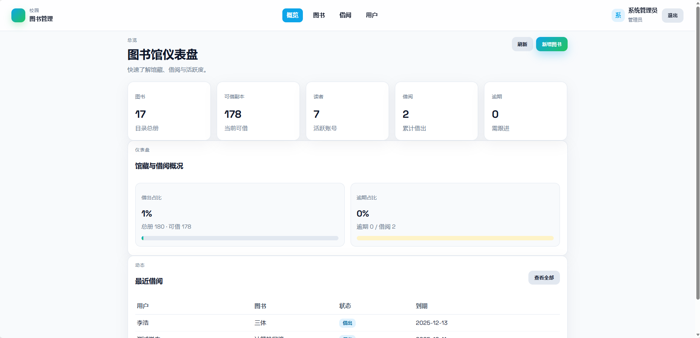
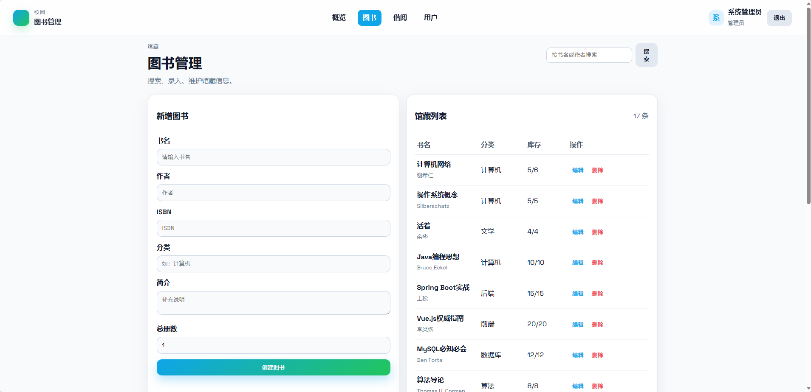

# Library Management System（Vue 3 + Spring Boot + MySQL）

## 项目简介
面向高校的图书管理系统，提供图书、用户、借阅全流程管理。后端基于 Spring Boot 3 + JPA + MySQL，前端使用 Vue 3（Vite）。

## 界面截图



## 目录结构
- `backend/`：Spring Boot API（图书、用户、借阅、登录）
- `frontend/`：Vue 3 界面（仪表盘、图书、借阅、用户）
- `img/1.png`、`img/2.png`：界面截图
- `init-database.bat`：初始化 MySQL 数据库
- `start-backend.bat` / `start-frontend.bat`：快捷启动脚本

## 环境要求
- Java 17、Maven 3.9+
- Node 20+、npm
- MySQL（默认 `root` / `123123`，库名 `library_db`）

## 快速开始（Windows）
1) 初始化数据库  
   双击或运行 `init-database.bat`（需 MySQL 已启动）。

2) 启动后端  
   双击 `start-backend.bat`，接口默认 `http://localhost:8080/api`。

3) 启动前端  
   双击 `start-frontend.bat`，开发地址 `http://localhost:5173`。首次会自动 `npm install`。

## 常用命令（手动）
```bash
# 初始化数据库（可选）
mysql -uroot -p123123 -e "CREATE DATABASE IF NOT EXISTS library_db DEFAULT CHARACTER SET utf8mb4 COLLATE utf8mb4_unicode_ci;"

# 后端
cd backend
mvn spring-boot:run        # 运行
mvn -q -DskipTests package # 打包

# 前端
cd frontend
npm install                # 首次/依赖变更
npm run dev -- --host      # 开发模式（5173）
npm run build              # 生产构建
```

## 配置说明
- 数据库连接：`backend/src/main/resources/application.yml`（可按需修改账号/端口）。
- 默认 CORS：允许前端本地开发端口访问。

### 预置账号
- 管理员：admin / admin123
- 馆员：librarian / lib123，zhangli / lib2024
- 学生：student / student123，chenli / stu2024，wangjuan / stu2025，lihao / stu2026